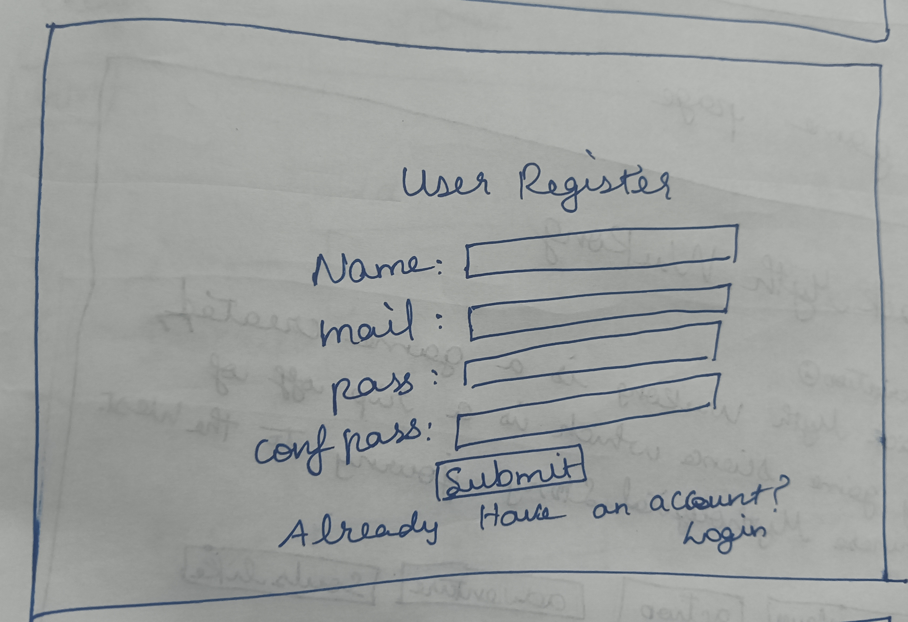

# Pages Details

The pages that are going to be there are:

- Login and register page for user and login for the admin

- Home page for the Admin.

- Add game page. 

- Home page for the user.

- Specific game info page. 

## Login page

### User Login & Registration 

- Users can create an account with email and password, then log in to access their profiles.

### Admin Login 

-  A separate admin panel for managing users, games, and updates.

## Home page for Admin

- It contains a Add game button which redirect to the next page.

- It also has the history of what are the games have been added in the bast.

## Add game page

It contains the form which have some fields to add like :

- Name of the game.

- Description about the game.

- Tags related to the game. 

- Images related to the game.

- Specs needed to the user recommendations.

- Websites where it is available.

- Standard price of the game.

- Submit button to save the game. 

## Home page for the user

- This home page consist of a navbar which contains:

  - Search bar to search the game.

  - Tags nav which can have the tags to search for.

  - Sort nav to sort the games in terms of publish or alphabatical.

- The main page of the home page consist of list or grid of game icons used to view them.

## Specific game info page

This page consist of the details about the game which we have chosen. Which consist of :

- Name of the game.
    - `BLACK MYTH WUKONG`

- Description about the game.
    -  `Wukong is an action RPG developed by Game Science, inspired by the classic Chinese novel Journey to the West. `

- Tags related to the game.
    - `Single player` 
    - `action`
    - `adventure`

- Images related to the game.

- Specs needed to the user recommendations.

    - **Operating System:** Windows 10 64-bit
    - **Processor:** Intel Core i7-9700 or AMD Ryzen 5 5500
    - **Memory:** 16 GB RAM
    - **Graphics:** NVIDIA GeForce RTX 2060, AMD Radeon RX 5700 XT, or Intel Arc A750
    - **DirectX:** Version 12
    - **Storage:** 130 GB SSD required

- Websites where it is available.

    - Steam `(https://store.steampowered.com/app/2358720/Black_Myth_Wukong/)`

    - EpicGames 
            `(https://store.epicgames.com/en-US/p/black-myth-wukong-87a72b)`

- Standard price of the game.
 
         Rs.3599

